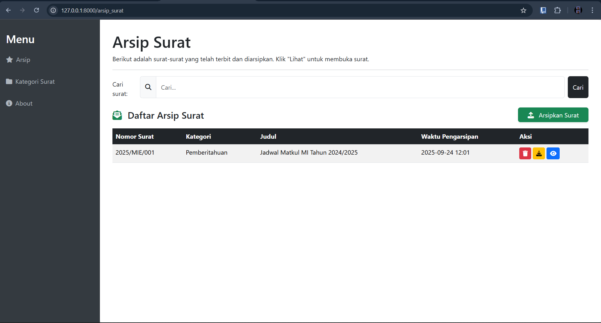
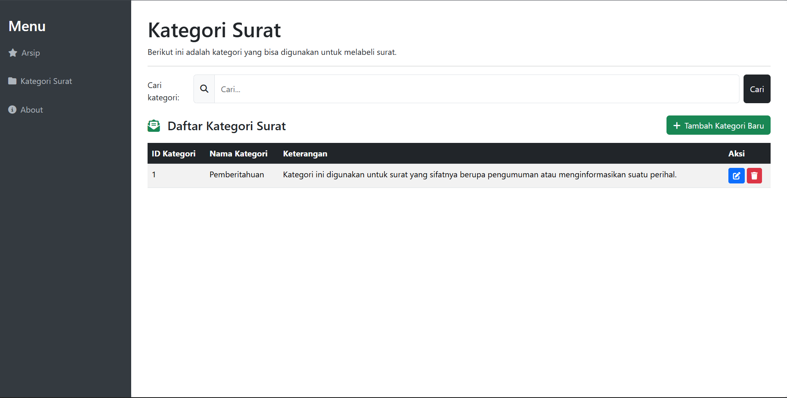
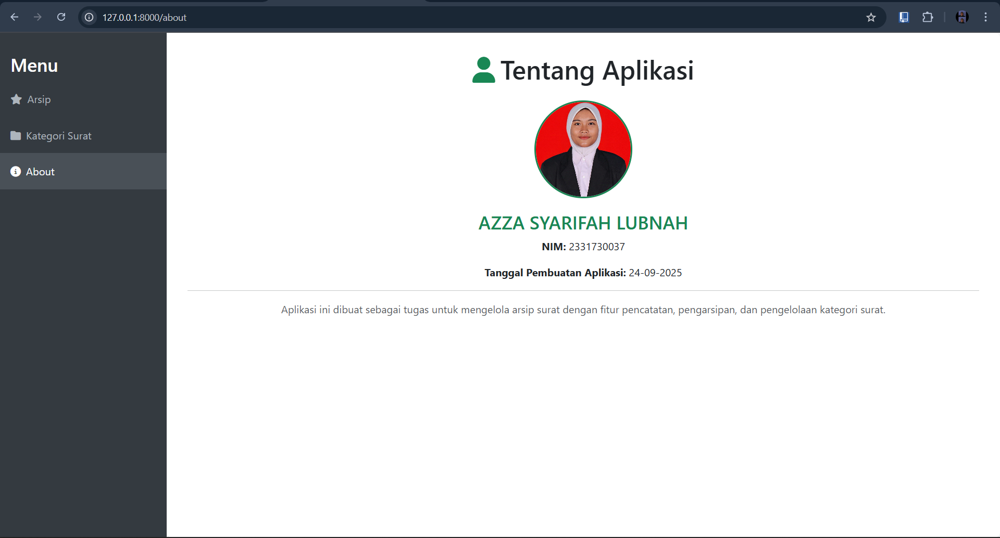

-----

# 📂 AppSurat: Aplikasi Arsip Surat Digital

Aplikasi web **AppSurat** adalah alat bantu untuk mengarsipkan dan mengelola surat-surat resmi secara digital. Dirancang untuk memudahkan staf administrasi desa atau petugas lainnya, aplikasi ini memungkinkan pembuatan, penyimpanan, dan tampilan surat-surat dalam format PDF, meminimalisir penggunaan kertas, dan meningkatkan efisiensi.

-----

## 🎯 Tujuan Proyek

  - **Meningkatkan Efisiensi:** Mempermudah proses pencatatan dan pengarsipan surat resmi.
  - **Go Green:** Mengurangi penggunaan kertas dengan sistem arsip digital.
  - **Akurasi Data:** Meminimalisir kesalahan yang sering terjadi pada pencatatan manual.
  - **Akses Cepat:** Memudahkan pencarian dan pencetakan surat sesuai kebutuhan.

-----

## ✨ Fitur Utama

  - **Manajemen Surat:** Kelola surat secara komprehensif, termasuk menambah, mengedit, menghapus, dan melihat detail surat. Surat dapat dikelompokkan berdasarkan kategori.
  - **Kategori Surat:** Fitur untuk membuat, mengedit, dan menghapus kategori surat, membantu penataan arsip agar lebih rapi.
  - **Export PDF:** Seluruh surat dapat diunduh atau dicetak dalam format PDF yang siap pakai.

-----

## 🛠️ Cara Menjalankan Aplikasi

Ikuti langkah-langkah di bawah ini untuk menginstal dan menjalankan **AppSurat** di perangkat lokalmu.

1.  **Clone Repositori:**

    ```bash
    git clone https://github.com/azzaa25/APPSURAT.git
    ```

2.  **Masuk ke Direktori Proyek:**

    ```bash
    cd AppSurat
    ```

3.  **Instal Dependensi Laravel:**

    ```bash
    composer install
    cp .env.example .env
    php artisan key:generate
    ```

4.  **Konfigurasi dan Import Database:**
    Pastikan kamu sudah menginstal MySQL.

    ```bash
    mysql -u root -p
    CREATE DATABASE arsip_surat_db;
    exit
    mysql -u root -p arsip_surat_db < arsip_surat_db.sql
    ```

5.  **Jalankan Server Laravel:**

    ```bash
    php artisan serve
    ```

    Aplikasi sekarang dapat diakses melalui `http://127.0.0.1:8000` atau alamat lokal yang muncul di terminal.

-----

## 📸 Tampilan Aplikasi

### Arsip Surat


### Kategori


### About 

